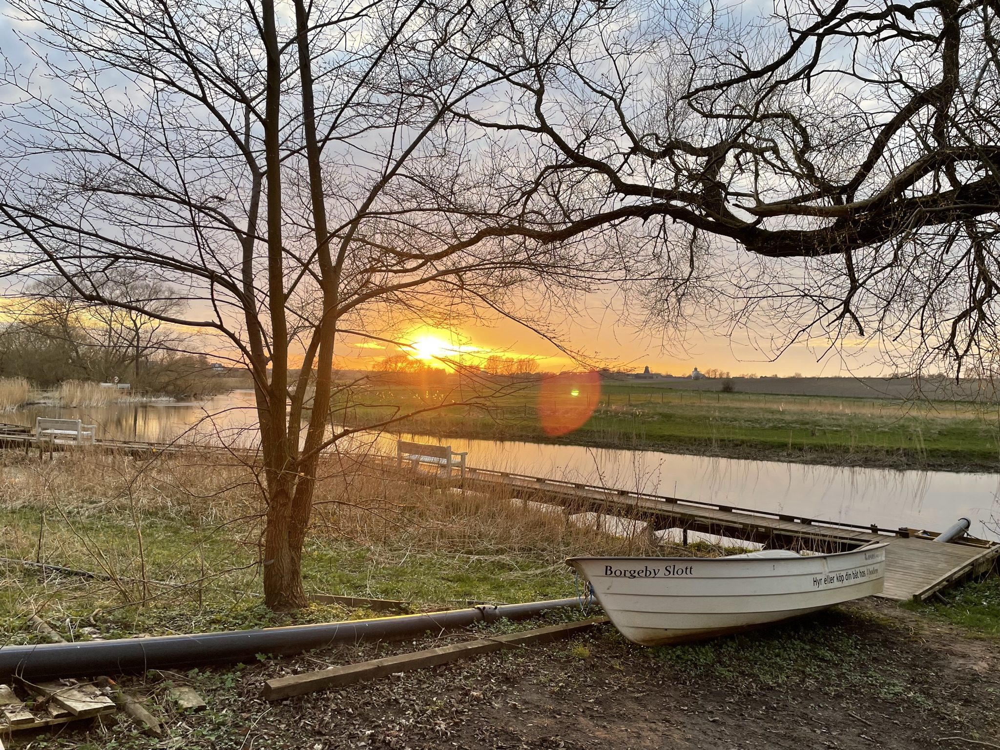
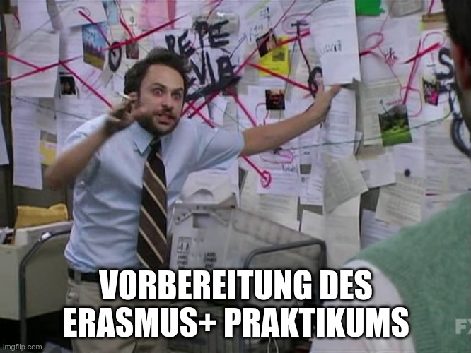
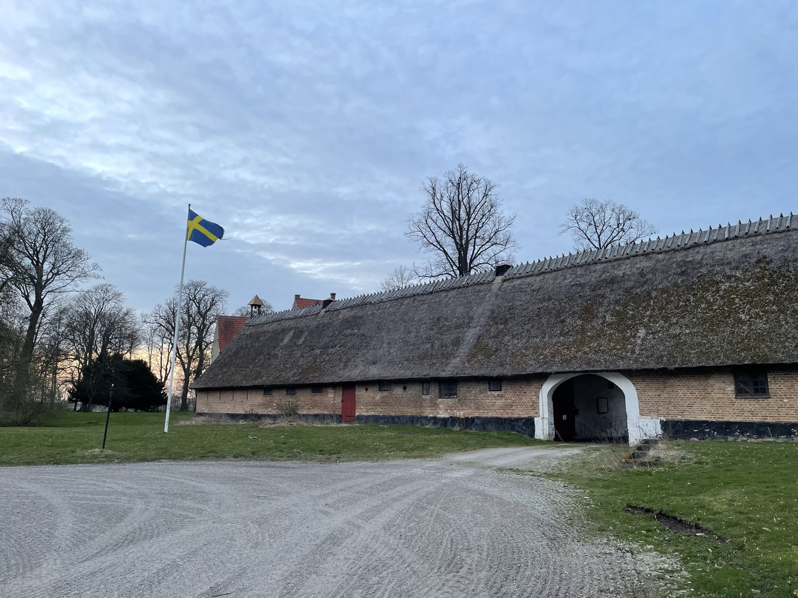
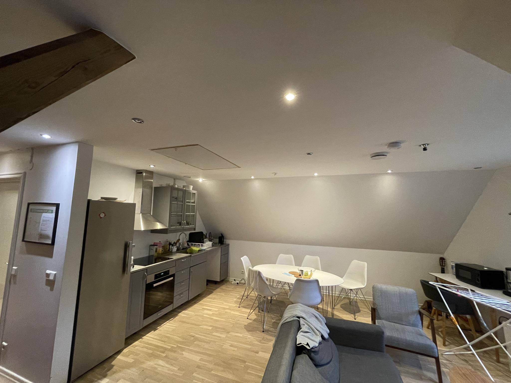
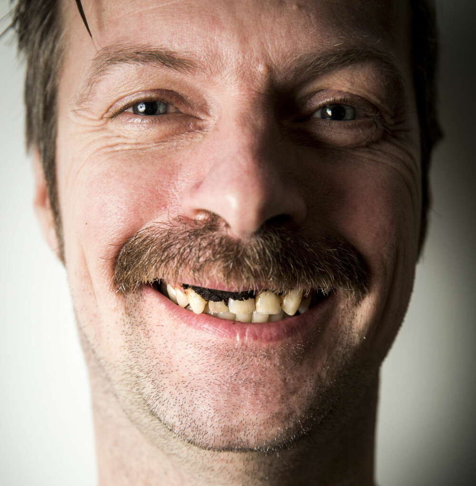
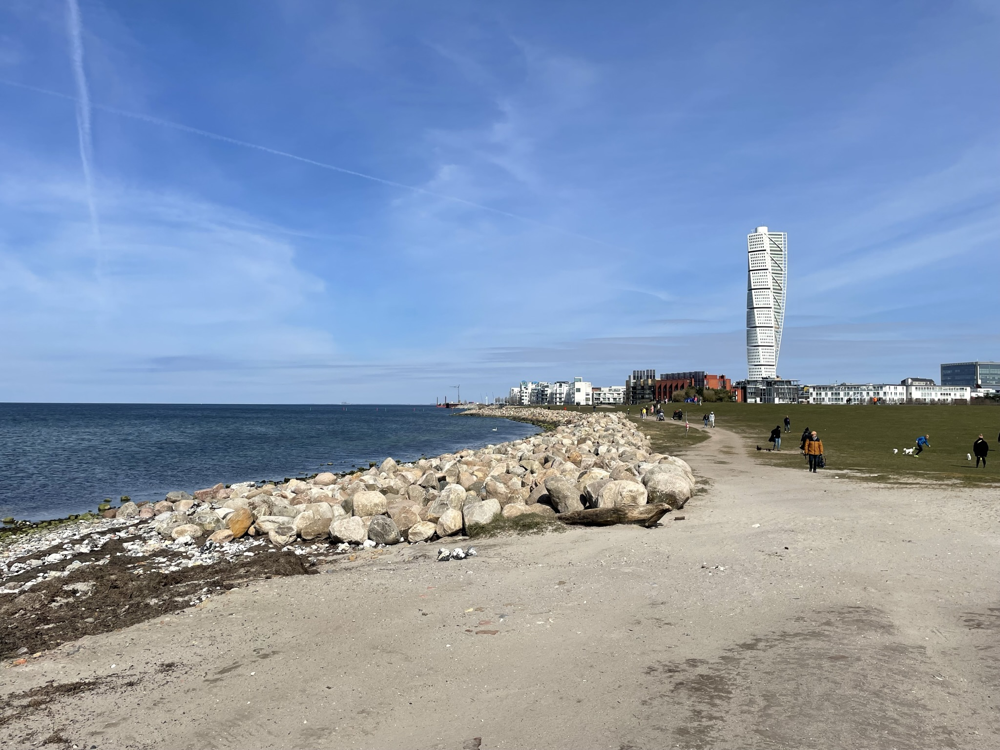
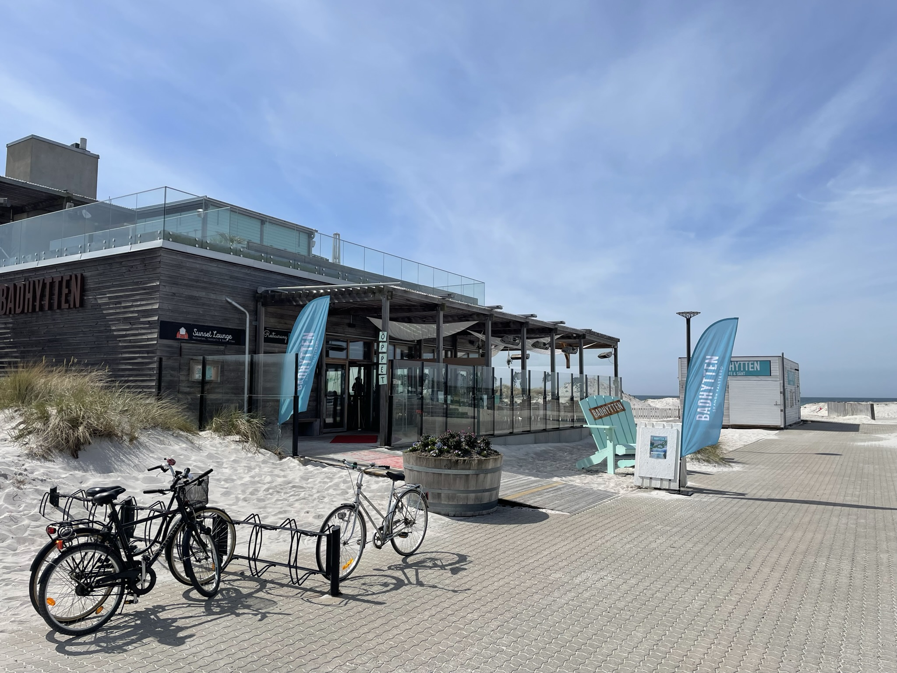
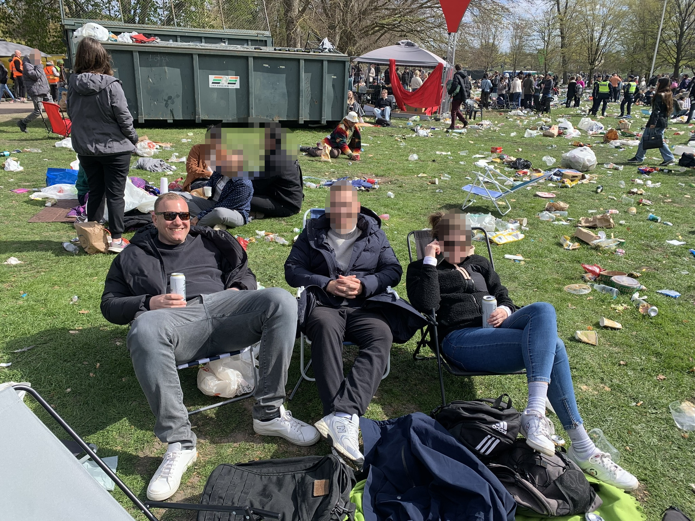
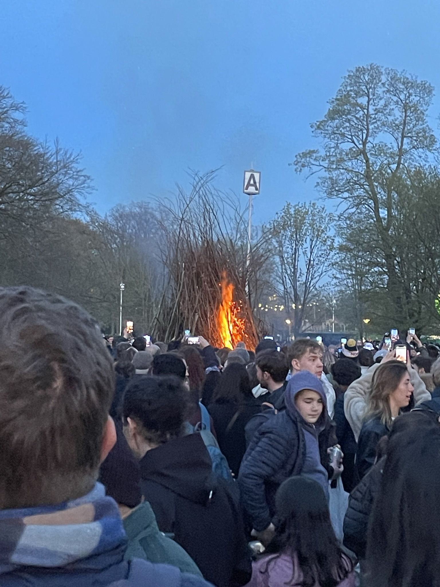

# Ehrfahrungsbericht ERASMUS+

## Vier Wochen Praktikum in Lund

---

---

# Gliederung

* Was ist ERASMUS+?
* Ablauf und Anmeldung
* Storvix AB
* Leben in Lund
* Herausforderugen
* Impressionen
* Fazit
* Frage- und Diskussionsrunde

--- 

# Gliederung

- **Was ist ERASMUS+?**
- Ablauf und Anmeldung
- Storvix AB
- Leben in Lund
- Herausforderugen
- Impressionen
- Fazit
- Frage- und Diskussionsrunde

---

# Was ist ERASMUS+?

Erasmus+ ist ein Programm der Europäischen Union, das die internationale Zusammenarbeit und Mobilitätin Bildung, Ausbildung, Jugend und Sport fördert. Es ermöglicht individuelle Lern- und Austauschmöglichkeiten für eine Vielzahl von Zielgruppen, darunter Schüler, Lehrlinge, Studenten, Lehrkräfte und Verwaltungspersonal.

<!--
Erklären, wo das PLUS herkommt: Zunächst nur für studenten, durch das PLUS auch für andere Zielgruppen
-->

---

# Ziele: 

* Schaffung eines Bewustseins für eine gemeinsame Europäische Identität
* Internationalisierung der europäischen Bildungssysteme 
* Inklusion und Vielfalt
* Digitaler Wandel
* Umweltschutz und Bekämpfung des Klimawandels
* Teilhabe am demokratischen Leben

---

# Gliederung

- Was ist ERASMUS+?
- **Ablauf und Anmeldung**
- Storvix AB
- Leben in Lund
- Herausforderugen
- Impressionen
- Fazit
- Frage- und Diskussionsrunde

---

# Ablauf und Anmeldung

* Rücksprache mit Ausbilder*in und Hanna
* Kontaktaufnahme mit IHK Köln
* INFO-Veranstaltung durch IHK Köln
* Planung und Vorbereitung des Praktikums
    * Selbständig
    * Unterstützung durch Partnerorganisation(en)

---

# Selbständige Organisation & Durchführung

* Erstellen von Lebenslauf und Motivationsschreiben
* Hochladen der Dokumente in der Eropass Datenbank
* Ausfüllen der Anträge der EU
* Suche nach Praktikumsplatz
* Anreise planen und Buchen
* Abschließen der Notwendigen Versicherungen 
    * Krankenversicherung (ggf. Auslandskrankenversicherung)
    * Haftpflichtversicherung am Arbeitsplatz
    * Unfallversicherung
    * Gesamtpakete möglich (z.B. DAAD)
* Suche nach einer passenden Unterkunft

---

# Unterstützung durch Partnerorganisation

* Erstellen von Lebenslauf und Motivationsschreiben
* Hochladen der Dokumente in der Eropass Datenbank
* Ausfüllen der Dokumente der Partnerorganisation
* Anreise planen und Buchen
* Abschließen der Notwendigen Versicherungen 
    * Krankenversicherung (ggf. Auslandskrankenversicherung)
    * Haftpflichtversicherung am Arbeitsplatz
    * Unfallversicherung
    * Gesamtpakete möglich (z.B. DAAD)

---

# Nach dem Praktikum

* Einreichen Belege Reisekosten an EU oder Partnerorganisation
* Ausfüllen des EU-Fragebogens

---

# Gliederung

- Was ist ERASMUS+?
- Ablauf und Anmeldung
- **Storvix AB**
- Leben in Lund
- Herausforderugen
- Impressionen
- Fazit

--- 

 
* Tech-Startup: Gegründet 2016
* Mission: Neugestaltung von Datenspeicherung, -verwaltung und -schutz
* Entwicklung der einzigartigen Datenmanagement-Software: **AiRE**
* AiRE nutzt "*KI*" für optimale Leistung, Belastbarkeit und Effizienz
* Software / Hardware und Sorage as a Service Lösungen

---

# Aufgabe bei Storvix

* Entwicklung eines **Minimum Viable Product** für ein Tool zur Angebotserstellung zusammen mit einer weiteren Praktikantin
* **Technologien:** React, Node.js, Express, MySQL, Sass, Docker
---

# Gliederung

- Was ist ERASMUS+?
- Ablauf und Anmeldung
- Storvix AB
- **Leben in Lund**
- Herausforderugen
- Impressionen
- Fazit

---
# Leben in Lund: Ideon Science Park

* Erster Forschungspark Schwedens
* Beherbergt über 400 Unternehmen
* Hauptfokus auf IT, Biologie und Umwelttechnik
* Grenzt an die Technische Universität Lund
* Inkubator für Startups
---
# Leben in Lund
## Unterkunft: Borgeby Slott

---

# Leben in Lund: Unterkunft

* Gemeinschaftsunterkunft mit Praktikant*innen aus der EU
* Busverbindung nach Lund und Malmö
* Internet, Küche, Waschmaschine, Trockner

---

# Leben in Lund: Transport

* Skånetrafiken App für den Kauf von Tickets
* 30-Tage-Ticket für Sightseeing: 1309 SEK (ca. 130€)
* Busse fahren Tagsüber merhmals pro Stunde
* Echtzeit Informationen über die App

---

# Leben in Lund: Lebensmittel

* ## Preise
    * Im Vergleich zu Deutschland sind die Lebensmittelpreise in Schweden höher
    * Ein Mittagessen in einem Restaurant kostet durchschnittlich 200-250 SEK (ca. 20-25 Euro)
    * Ein Kaffee kostet etwa 45-60 SEK (ca. 4,50-6 Euro)

* ## Spezialitäten

    * Köttbullar (Fleischbällchen)
    * Kannellbullar (Zimtschnecken)
    * [Kalles Kaviar](https://www.youtube.com/watch?v=HMyfZydK-4s)
---
# Leben in Lund: Praktische Informationen
* Trinkbares Leitungswasser
* Bevorzugte Zahlungsmethode: Karte
* Steckdosentyp: C, F

---

# Leben in Lund: Interssante Fakten

* ## Wichtige Feiertage
    * Walpurgnisnacht *Valborg* (30. April)
    * Midsommar (Juni)

* ## Sonstiges
    * **Fika:** Eine schwedische Tradition, die eine Pause für Kaffee und Gebäck (oft Kanelbullar) beinhaltet
    * **Snus:** Ein Tabakprodukt, das unter die Oberlippe gelegt wird. Es ist in Schweden sehr verbreitet und ein wichtiger Teil der schwedischen Tabakkultur
---
# Snus Genuss

---
# Gliederung

- Was ist ERASMUS+?
- Ablauf und Anmeldung
- Storvix AB
- Leben in Lund
- **Herausforderugen**
- Impressionen
- Fazit

---
# Herausforderungen

* ## Praktikumsplatz
    * Ursprunglich geplanter Betrieb kam für mich nicht in Frage
    * **Lösung:** Einigung mit Partnerorganistion auf Storvix AB

* ## Unterkunft
    * Wohnbedingungen in der Unterkunft waren nicht optimal
    * Lage der Unterkunft war nicht ideal
    * **Lösung:** Alternativen nicht möglich, daher haben wir das Beste daraus gemacht

---
# Gliederung

- Was ist ERASMUS+?
- Ablauf und Anmeldung
- Storvix AB
- Leben in Lund
- Herausforderugen
- **Impressionen**
- Fazit

---

---

---

---

---

---

---

---
# Gliederung

- Was ist ERASMUS+?
- Ablauf und Anmeldung
- Storvix AB
- Leben in Lund
- Herausforderugen
- Impressionen
- **Fazit**
---
# Fazit

* Ein ERASMUS+ Praktikum ist eine wertvolle Erfahrung, die ich jedem empfehlen würde
* Es bietet eine einzigartige Möglichkeit, sowohl berufliche als auch persönliche Erfahrungen zu sammeln
* Es ermöglicht Einblicke in andere Unternehmen und Arbeitsweisen
* Es bietet die Möglichkeit, neue Freundschaften zu schließen und neue Kulturen kennenzulernen

---

# Tack så mycket! *(Vielen Dank!)*

